# aws-cloudwatch-404-monitoring
Monitoreo de errores HTTP 404 en un servidor web usando AWS CloudWatch, métricas, alarmas y SNS.

📌 1. Introducción

Este laboratorio implementa una solución de monitoreo para detectar errores HTTP 404 en un servidor web desplegado en AWS EC2, utilizando CloudWatch Logs, Metric Filters y Alarmas.

⚠️ 2. Problemática

Las aplicaciones web pueden generar errores (como 404) que afectan la experiencia del usuario, pero sin monitoreo:

No se detectan a tiempo
No hay alertas
Se depende de que el usuario reporte

💡 3. Solución

Se implementa:

CloudWatch Logs → captura de logs
Metric Filters → detección de errores
CloudWatch Alarms → alertas
SNS → notificación por correo

⚙️ 4. Implementación
🔹 4.1 Verificación del servidor Apache
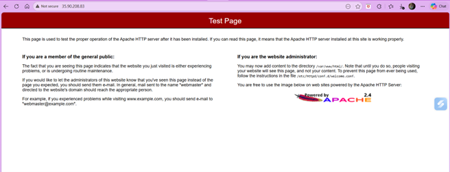
*Figura 1. Página de prueba del servidor Apache funcionando correctamente.*

🔹 4.2 Generación de error 404
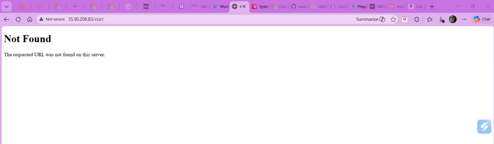
*Figura 2. Generación de error HTTP 404 al acceder a una ruta inexistente.*

🔹 4.3 Configuración de logs en CloudWatch
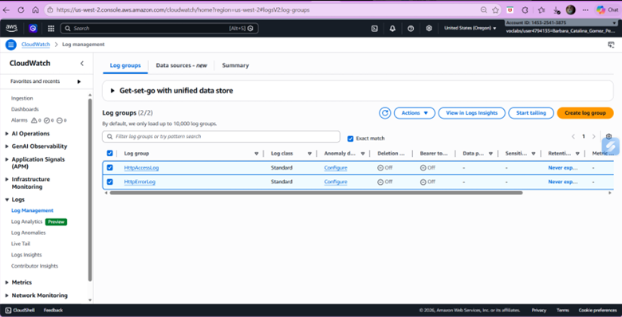
*Figura 3. Grupos de logs creados para almacenar eventos del servidor.*

🔹 4.4 Visualización de eventos
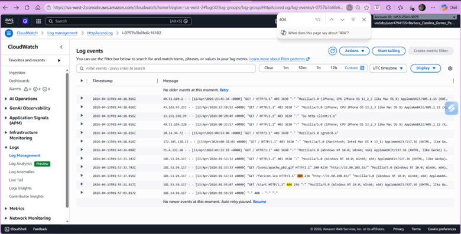
*Figura 4. Visualización de eventos HTTP en CloudWatch Logs.*

🔹 4.5 Creación del Metric Filter
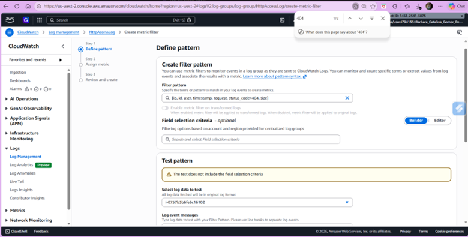
*Figura 5. Definición del filtro para detectar errores 404 en logs.*

🔹 4.6 Validación del filtro
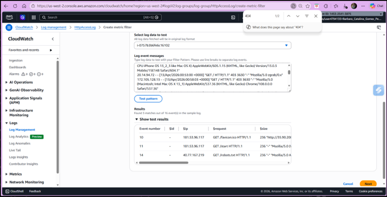
*Figura 6. Validación del filtro mostrando coincidencias con errores 404.*

🔹 4.7 Configuración de la métrica
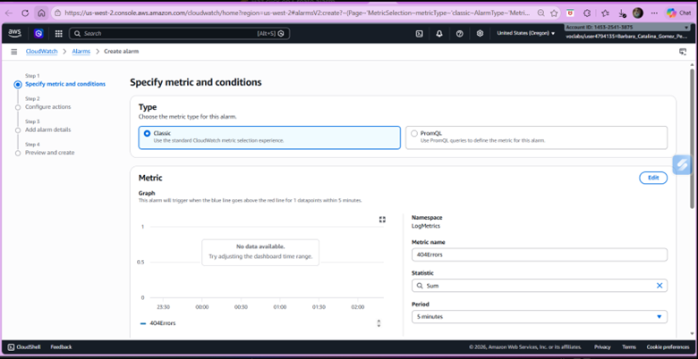
*Figura 7. Configuración de la métrica basada en errores 404.*

🔹 4.8 Configuración de notificaciones (SNS)
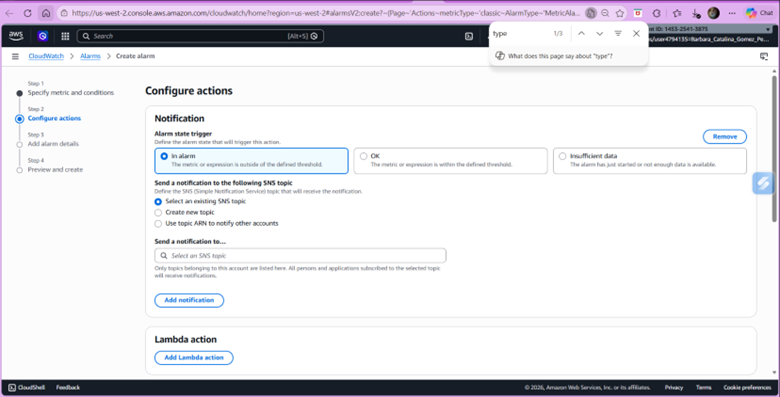
*Figura 8. Configuración del envío de notificaciones mediante SNS.*

🔹 4.9 Detalles de la alarma
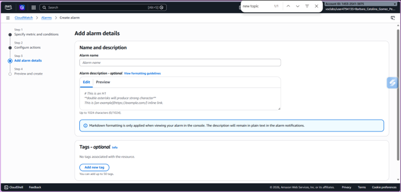
*Figura 9. Definición del nombre y descripción de la alarma.*

🔹 4.10 Creación de la alarma
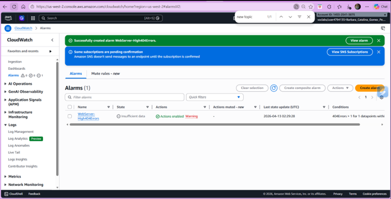
*Figura 10. Confirmación de creación de la alarma en CloudWatch.*

🔹 4.11 Alarma activada
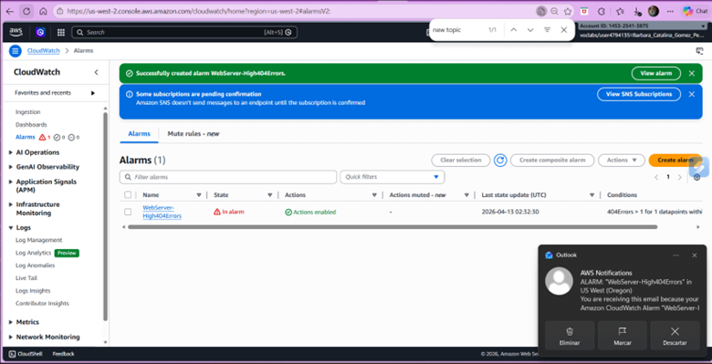
*Figura 11. Activación de la alarma tras generar múltiples errores 404.*

✅ 5. Validación

Se comprobó:

Generación de errores 404
Registro en logs
Conversión a métricas
Activación de alarma
Recepción de notificación

📊 6. Conclusión

Se logró implementar un sistema de monitoreo proactivo que permite detectar errores en tiempo real y notificar automáticamente, mejorando la observabilidad del sistema.

